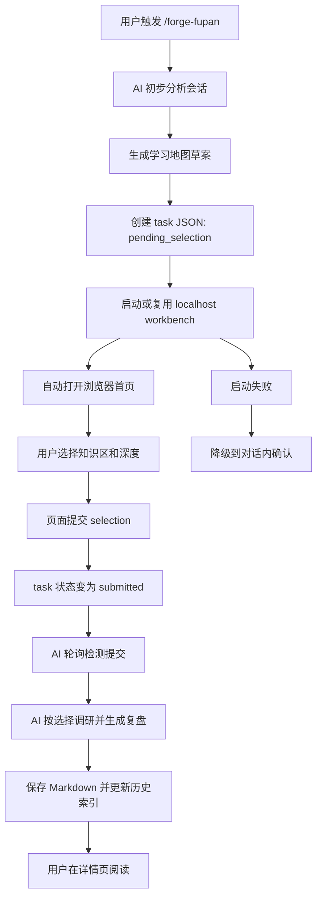

# Forge — 产品需求文档 (PRD)

**版本:** v2026.04.24-fupan-workbench
**日期:** 2026-04-24
**状态:** 需求确认

---

## 迭代历史摘要

### v2026.04.24-fupan-workbench — Fupan Workbench 本地交互式复盘学习工作台

- 为 `forge-fupan` 增加本地 localhost 学习工作台：复盘启动后先让用户在网页中确认要学习的知识点、学习深度和补充反馈，再继续调研和生成复盘。
- 将复盘从“会话结束后生成 Markdown 报告”升级为“前端交互确认 + Markdown 归档 + 网页阅读”的轻量闭环。
- 第一版面向本机单用户，不做账号、云同步、数据库、知识图谱、复杂编辑器。
- **迭代交付说明**：
  - 前端：一个首页工作台 + 一个复盘详情页；首页包含当前待确认任务和历史复盘列表。
  - 后端：本地 FastAPI 服务，绑定 `127.0.0.1`，提供 task 状态、提交选择、历史复盘扫描、静态前端托管。
  - 复盘流程：`forge-fupan` 生成学习地图草案 → 打开页面 → 用户提交 → AI 轮询 task 状态 → 按选择继续复盘。
  - 验收标准：用户不需要回命令行即可完成学习选择；超时或服务失败时可降级到对话内确认。
  - 受影响文件：`skills/forge-fupan/SKILL.md`、`skills/forge-fupan/parse_tokens.py`、新增 `skills/forge-fupan/workbench/`。
  - 关联变更：`README.md`、`docs/skills-reference.md`、`CHANGELOG.md` 需要在实现完成后同步说明。

---

## 一、产品定位

Forge 是一套规范驱动的 AI 辅助开发 Skill。`forge-fupan` 位于反馈层，负责在工作结束后沉淀知识、复盘协作过程、反哺后续 Skill 使用。

当前 `forge-fupan` 的主要问题不是缺少信息，而是学习入口不适合用户：复盘文档过长、专业名词密集、Prompt 诊断有批改感、知识拓展没有先询问用户想学什么和学到什么程度。

Fupan Workbench 的核心价值是：

> 让复盘先经过用户学习意图校准，再生成适合阅读和长期学习的复盘内容。

目标用户：

- 使用 Forge Skill 的个人开发者或小团队成员。
- 希望从 AI 协作中学习技术、产品、工程方法，但不想硬读长篇 Markdown 报告的人。
- 希望历史复盘可以像本地知识库一样按项目浏览、回看、学习的人。

---

## 二、信息架构

### 2.1 核心对象

| 对象 | 说明 | 存储方式 |
|---|---|---|
| 复盘任务 Task | 一次 `forge-fupan` 启动后创建的交互任务，包含学习地图草案和用户选择；允许多个 task 并存 | 本地 JSON |
| 学习知识区 Topic | AI 从会话中推测出的可学习领域，如 React、FastAPI、API 限流、Git worktree | Task JSON 内嵌 |
| 用户选择 Selection | 用户选择的知识区、学习深度、补充反馈 | 本地 JSON 或 Task JSON 更新 |
| 复盘文档 Review | 最终生成的 Markdown 复盘文件 | `~/claudecode_workspace/记录/复盘/{项目名}/` |
| 历史索引 Index | 用于前端展示项目、时间、标题、标签、摘要 | 从 Markdown frontmatter + `INDEX.md` 扫描生成，可缓存 JSON |

### 2.2 页面结构

第一版只保留两个页面：

| 页面 | 路径 | 主要职责 |
|---|---|---|
| 首页工作台 | `/` | 展示复盘任务队列、当前展开任务、历史复盘列表 |
| 复盘详情页 | `/review/{review_id}` | 渲染单篇复盘，突出学习内容、专业名词、人话解释、下次怎么说 |

首页工作台采用单页分区，减少跳转：

1. 顶部状态栏：服务状态、当前活跃 task、最近更新时间。
2. 复盘任务队列：允许多个 `pending_selection` / `submitted` / `failed` task 并存，按状态和时间排序。
3. 当前展开任务区：默认展开当前会话创建的 task；用户可切换查看其他 pending task。
4. 历史复盘区：按项目文件夹分组，组内按时间倒序。

---

## 三、核心功能详细设计

### 3.1 Fupan Workbench 本地交互闭环

#### 3.1.1 功能概述

当用户触发 `/forge-fupan` 时，AI 不再直接生成完整复盘，而是先分析会话并生成“学习地图草案”。随后系统启动或复用本地 workbench 服务，自动打开浏览器。用户在页面中选择要学习的知识区、每个知识区的学习深度，并填写补充反馈。页面提交后，AI 轮询到 task 已提交，继续调研并生成最终复盘。

第一版学习深度分三档：

| 深度 | 含义 | 输出要求 |
|---|---|---|
| 了解 | 知道有这么个东西，看到名词不慌 | 人话解释 + 本次为什么出现 + 不必深入学什么 |
| 表达 | 能说出关键词，借助 AI 实现 | 关键词表 + 下次可以怎么说 + 常见误区 |
| 复现 | 需要详细理解原理，能自己复述、复现 | 原理拆解 + 最小可复现实例 + 检查清单 + 练习方向 |

#### 3.1.2 详细行为

1. `forge-fupan` 完成前置脚本和会话初步分析。
2. AI 提取：
   - 本次会话背景。
   - 用户原话中的问题和困惑。
   - AI 推测的知识区。
   - 每个知识区为什么与本次会话有关。
   - AI 推荐的默认学习优先级，但不代替用户选择。
3. 系统创建 task JSON，状态为 `pending_selection`。
4. 系统启动或复用本地 FastAPI 服务：
   - 默认绑定 `127.0.0.1`。
   - 默认端口由实现确定，但必须支持端口占用时自动选择备用端口。
   - 已有服务可用时复用，不重复启动。
5. 系统自动打开浏览器到首页工作台，并在当前展开任务区显示本次 task 的学习地图草案。
6. 用户在页面中：
   - 勾选要学习的知识区，数量由用户决定。
   - 为每个知识区选择 `了解 / 表达 / 复现`。
   - 可填写补充反馈，例如“React 从零讲，不要假设我懂”。
7. 用户点击提交。
8. 页面写入 selection，task 状态变为 `submitted`。
9. AI 在对话中等待并只轮询自己创建的 task ID，不消费其他会话创建的 task。
10. AI 检测到 `submitted` 后读取 selection。
11. AI 按用户选择进行调研和写作。
12. 系统保存最终 Markdown，并更新网页历史索引。
13. 用户可在首页历史区看到新复盘，并点击进入详情页阅读。

#### 3.1.3 异常处理

| 场景 | 处理 |
|---|---|
| FastAPI 依赖缺失 | 提示缺失依赖，并降级到对话内确认 |
| 端口被占用 | 自动选择备用端口，并在对话中显示实际 URL |
| 浏览器自动打开失败 | 在对话中输出 localhost URL |
| 用户 30 分钟未提交 | AI 停止等待，提示页面仍可继续，用户可稍后重新触发读取 |
| task JSON 损坏 | 页面显示错误，AI 降级到对话内确认 |
| 历史 Markdown 无 frontmatter | 历史列表仍展示文件名和修改时间，详情页按普通 Markdown 渲染 |
| 页面提交后 AI 会话已结束 | task 保持 `submitted`，下次 `forge-fupan` 或恢复命令可继续读取 |

#### 3.1.4 Feature Spec

##### 用户流程总览

主流程：

1. 用户在对话中触发 `/forge-fupan`。
2. AI 分析会话并生成学习地图草案。
3. Workbench 自动打开。
4. 用户在首页当前任务区选择知识区和学习深度。
5. 用户提交选择。
6. AI 自动检测提交并继续生成复盘。
7. 用户在网页详情页阅读结果。

多任务流程：

1. 多个会话可分别创建多个复盘 task。
2. 首页显示任务队列，但一次只展开一个 task 的完整选择表单。
3. 当前会话创建的 task 默认置顶并自动展开。
4. 用户可手动切换到其他 pending task 进行选择。
5. 每个 AI 会话只轮询自己的 task ID，不会误读或消费其他 task。

异常流程：

1. Workbench 启动失败时，AI 走对话内确认。
2. 用户长时间未提交时，AI 暂停等待并说明恢复方式。
3. 历史复盘解析失败时，页面保留基础文件浏览能力。

##### 页面/系统结构

前端结构：

| 区块 | 内容 | 交互 |
|---|---|---|
| 顶部状态栏 | 当前服务 URL、任务状态、最近更新时间 | 刷新 |
| 任务队列区 | 多个复盘 task 的标题、项目、状态、创建时间 | 切换展开、查看状态 |
| 当前展开任务区 | 会话背景、用户原话、知识区卡片、反馈框 | 勾选、选择深度、提交 |
| 历史复盘区 | 项目分组、时间倒序、标题、标签、摘要 | 点击进入详情页 |
| 详情页 | Markdown 渲染、目录、学习卡片、外链 | 返回首页、打开源文件路径 |

后端结构：

| 模块 | 职责 |
|---|---|
| server | 启动 FastAPI，托管 API 和静态前端 |
| task_store | 创建、读取、更新 task JSON |
| review_index | 扫描复盘目录并生成历史索引 |
| markdown_reader | 读取 Markdown、frontmatter、摘要 |
| launcher | 启动服务、检测端口、打开浏览器 |

##### 行为场景

**场景 1：正常完成学习选择**

- Given 用户触发 `/forge-fupan`，当前会话可分析出至少 1 个知识区
- When AI 创建 task 并打开 Workbench，用户选择知识区和深度后提交
- Then task 状态变为 `submitted`，AI 读取 selection 并继续生成复盘

**场景 2：用户不想学习某些知识区**

- Given 页面展示 AI 推测的多个知识区
- When 用户取消勾选某些知识区
- Then 最终复盘不得展开被取消的知识区，只能在附录或未选列表中简短记录

**场景 3：用户选择“复现”深度**

- Given 某个知识区被选择为 `复现`
- When AI 生成最终复盘
- Then 该知识区必须包含原理拆解、最小可复现实例、复现检查清单和进一步练习方向

**场景 4：Workbench 启动失败**

- Given 本机无法启动 FastAPI 服务或依赖缺失
- When `forge-fupan` 尝试启动 Workbench 失败
- Then AI 必须降级到对话内选择流程，并说明失败原因和恢复方式

**场景 5：历史复盘浏览**

- Given 本地存在多个项目的复盘 Markdown
- When 用户打开首页工作台
- Then 历史复盘区按项目分组，组内按时间倒序展示，点击任意条目进入详情页

**场景 6：用户超时未提交**

- Given AI 已打开 Workbench 并开始等待
- When 30 分钟内 task 状态仍为 `pending_selection`
- Then AI 停止轮询，在对话中说明“页面仍可提交，下次可继续读取”，不得无限等待

**场景 7：多个复盘任务同时存在**

- Given 本地存在 2 个以上 `pending_selection` 或 `submitted` task
- When 用户打开首页工作台
- Then 页面必须显示任务队列，并默认展开当前会话创建的 task；其他 task 以紧凑行展示，不得同时展开多个完整表单

**场景 8：AI 只消费自己的 task**

- Given 当前 AI 会话创建 task A，同时本地存在另一个会话创建的 task B
- When task B 被用户提交
- Then 当前 AI 不得读取 task B 继续生成；只有 task A 变为 `submitted` 时才继续

##### 验收检查表

功能验证：

- [ ] 触发 `forge-fupan` 后能创建 `pending_selection` task JSON。
- [ ] Workbench 能绑定 `127.0.0.1` 并打开浏览器。
- [ ] 首页能展示当前待确认任务。
- [ ] 多个 task 并存时，首页能展示任务队列。
- [ ] 当前会话创建的 task 默认置顶并展开。
- [ ] 页面一次只展开一个完整任务表单。
- [ ] 用户能勾选知识区，并为每个知识区选择 `了解 / 表达 / 复现`。
- [ ] 用户能填写补充反馈。
- [ ] 提交后 task 状态变为 `submitted`。
- [ ] AI 能读取 submitted selection 并按选择生成复盘。
- [ ] 未选择的知识区不会被长篇展开。
- [ ] Markdown 归档路径仍符合既有 `forge-fupan` 输出位置规则。
- [ ] 历史复盘能按项目分组、时间倒序显示。
- [ ] 点击历史条目能进入详情页并渲染 Markdown。

降级与稳定性：

- [ ] FastAPI 不可用时能降级到对话内确认。
- [ ] 浏览器打开失败时能输出可点击 URL。
- [ ] 端口占用时能选择备用端口。
- [ ] 等待 30 分钟未提交时不会无限阻塞。
- [ ] AI 轮询只读取当前 task ID，不会消费其他 task。
- [ ] task JSON 损坏时页面给出可理解错误，并允许对话内降级。

视觉与体验：

- [ ] 首页首屏优先显示当前待确认任务，而不是历史列表。
- [ ] 没有 pending task 时，首页默认显示历史复盘。
- [ ] 知识区卡片必须包含“人话解释”“为什么与本次有关”“推荐深度”。
- [ ] 深度选择文案必须是 `了解 / 表达 / 复现`，不得使用旧四档。
- [ ] 页面不要求用户理解 JSON、文件路径或命令行状态。

---

## 四、数据模型

### 4.1 Task JSON

字段要求：

| 字段 | 类型 | 说明 |
|---|---|---|
| id | string | task 唯一 ID |
| status | string | `pending_selection` / `submitted` / `consumed` / `failed` |
| created_at | string | 创建时间 |
| updated_at | string | 更新时间 |
| project | string | 项目名 |
| session | string | 会话标识 |
| source_thread | string | 创建该 task 的对话/线程来源，可为空 |
| active | boolean | 是否为当前会话默认展开 task |
| summary | string | 本次会话背景摘要 |
| user_questions | array | 用户原话或问题摘录 |
| topics | array | AI 推测的知识区 |
| selection | object | 用户提交后的选择 |

### 4.2 Topic

| 字段 | 类型 | 说明 |
|---|---|---|
| id | string | topic ID |
| title | string | 知识区名称 |
| plain_explanation | string | 人话解释 |
| why_relevant | string | 为什么和本次会话有关 |
| recommended_depth | string | AI 推荐深度 |
| selected | boolean | 用户是否选择 |
| depth | string | `了解` / `表达` / `复现` |

### 4.3 Review Index

| 字段 | 类型 | 说明 |
|---|---|---|
| id | string | 复盘条目 ID |
| project | string | 项目名 |
| title | string | 标题 |
| path | string | Markdown 文件路径 |
| created_at | string | 创建时间 |
| learned_topics | array | 本篇复盘最终学习了什么 |
| summary | string | 摘要 |

---

## 五、已知问题与改进计划

### P0 — 第一版必须解决

- `forge-fupan` 复盘前必须先进行学习地图确认。
- 用户必须能在网页中选择知识区数量和学习深度。
- 页面提交后 AI 必须能自动继续，不要求用户回命令行输入“好了”。
- 历史复盘必须能网页阅读。

### P1 — 第一版后可优化

- 历史复盘标题、标签、摘要的提取质量。
- Markdown 详情页的目录、锚点和代码块样式。
- 用户在页面里编辑复盘标题或标签。
- 任务提交后页面实时显示生成进度。

### P2 — 暂不做

- 账号系统。
- 云端同步。
- 数据库。
- 全文搜索。
- 知识图谱。
- 自动后台唤醒新 AI 会话。
- 多用户权限。

---

## 六、技术约束

### 6.1 推荐技术路线

第一版推荐：

- 后端：FastAPI 本地服务。
- 前端：React + Vite 开发，构建后作为静态文件随 Skill 分发。
- 存储：本地 JSON + Markdown，不引入数据库。
- 绑定地址：只绑定 `127.0.0.1`。
- 运行模式：`forge-fupan` 启动或复用服务，不要求用户手动运行 npm dev server。

### 6.2 分发约束

- Forge Skill 应尽量降低安装门槛。
- React 源码可以存在，但运行态应优先使用已构建静态文件。
- 如果 FastAPI 或其他依赖缺失，必须可降级。
- 不得要求用户配置账号或云服务。

### 6.3 安全约束

- 服务默认只监听 `127.0.0.1`，不得监听 `0.0.0.0`。
- API 只读写 `forge-fupan` 明确管理的 task/index 文件，以及既有复盘目录。
- 页面不得暴露环境变量、token、shell 输出或任意文件浏览能力。
- 打开本地文件路径时只作为文本显示或安全链接，不提供任意文件写入。

---

## 七、交互流程图

---

## 八、前端设计原则

第一版不做视觉炫技，目标是清楚、低干扰、可长期阅读。

设计原则：

- 首页优先显示当前待确认任务。
- 历史列表只作为次级区域，不抢当前任务注意力。
- 知识区卡片必须用人话解释，避免专业词直接轰炸。
- 详情页要把“学习内容”置于工程证据之前。
- Prompt 相关内容不得使用“浪费轮次”“知识空白”这类让用户产生批改感的措辞。
- 所有前端设计阶段必须使用 Image 2 生成视觉稿，先让用户看图确认整体效果，再进入实现。
- 历史复盘列表只展示“学到的知识”，不得展示 “My selections”、用户当时选择的深度或选择过程。

推荐详情页阅读结构：

1. 这次发生了什么。
2. 我当时真正想解决什么。
3. 本次我选择学习的知识地图。
4. 每个知识区的人话解释、专业关键词、下次怎么说。
5. 工程事实和证据附录。

---

## 九、技术栈

| 层 | 技术 | 说明 |
|---|---|---|
| 后端 | FastAPI | 本地 API、静态文件托管、task 状态读写 |
| 前端 | React + Vite | 开发交互页面，构建后随 Skill 分发 |
| 存储 | JSON + Markdown | 避免数据库和迁移复杂度 |
| Markdown 渲染 | 前端渲染或后端读取后返回文本 | 第一版只需可靠展示，不要求复杂编辑 |
| 启动 | Python launcher | 检查端口、启动服务、打开浏览器 |

---

## 附录：修改清单总结

第一版建议实施清单：

1. 在 `skills/forge-fupan/workbench/` 新增本地服务和前端。
2. 修改 `skills/forge-fupan/SKILL.md`，在 Phase 1 后加入“学习地图确认”阶段。
3. 新增 task JSON 规范和 task 存储目录。
4. 新增 Workbench 启动/复用/自动打开浏览器流程。
5. 修改知识拓展生成逻辑，只展开用户选择的知识区，并按 `了解 / 表达 / 复现` 调整深度。
6. 新增历史复盘扫描和详情页展示。
7. 新增失败降级路径。
8. 更新 README、skills reference、CHANGELOG。
