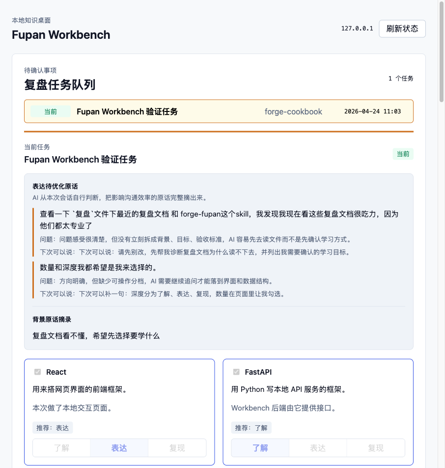
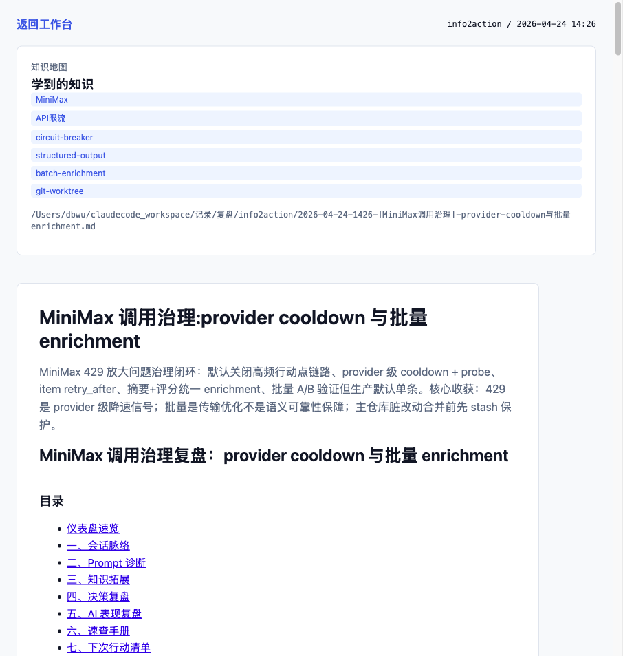

# v2026.04.24.3 — Fupan Workbench 批注修复

本次是 `v2026.04.24.2` 的 Workbench 体验补丁，重点修复用户在浏览器里标注出的布局问题，并补齐“表达待优化原话”的数据契约。

## 能力说明

### 复盘前学习确认

Workbench 首页会展示当前复盘任务、LLM 判断出的表达待优化原话、背景原话、候选知识点和三档学习深度。用户可以在本地页面确认“学什么、学到什么程度”，再让 `forge-fupan` 继续调研。

### 历史复盘网页阅读

历史复盘详情页会把 Markdown 复盘文档渲染成网页，左侧展示知识地图，正文保留复盘内容，便于把本地 Markdown 文件库转成可阅读的本地知识库。

## 修复内容

- 修复顶部 `127.0.0.1` 与“刷新状态”按钮在中等宽度下重合。
- 修复知识点卡片的 `了解 / 表达 / 复现` 按钮不在底部对齐。
- 修复反馈输入框与 footer 操作区间距不足。
- 新增 `expression_issue_quotes` task 字段，`forge-fupan` 生成学习地图时由 LLM 自行判断并摘录表达待优化原话。
- 前端兼容老 task：没有 `expression_issue_quotes` 时仍显示 `user_questions`。

## 验收

- `npm run build` passed
- `pytest` passed: `5 passed`
- `python3 -m py_compile skills/forge-fupan/workbench/*.py` passed
- Playwright 截图已写入 `docs/assets/fupan-workbench/`
- 浏览器 console error = 0
